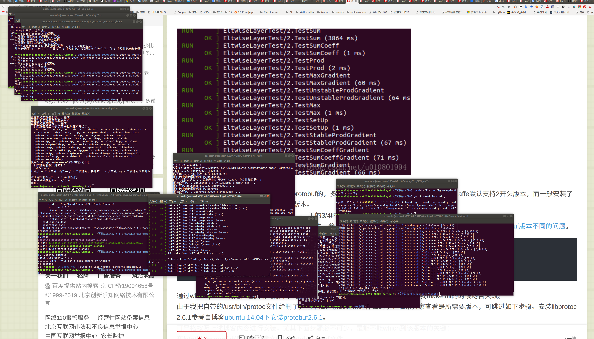
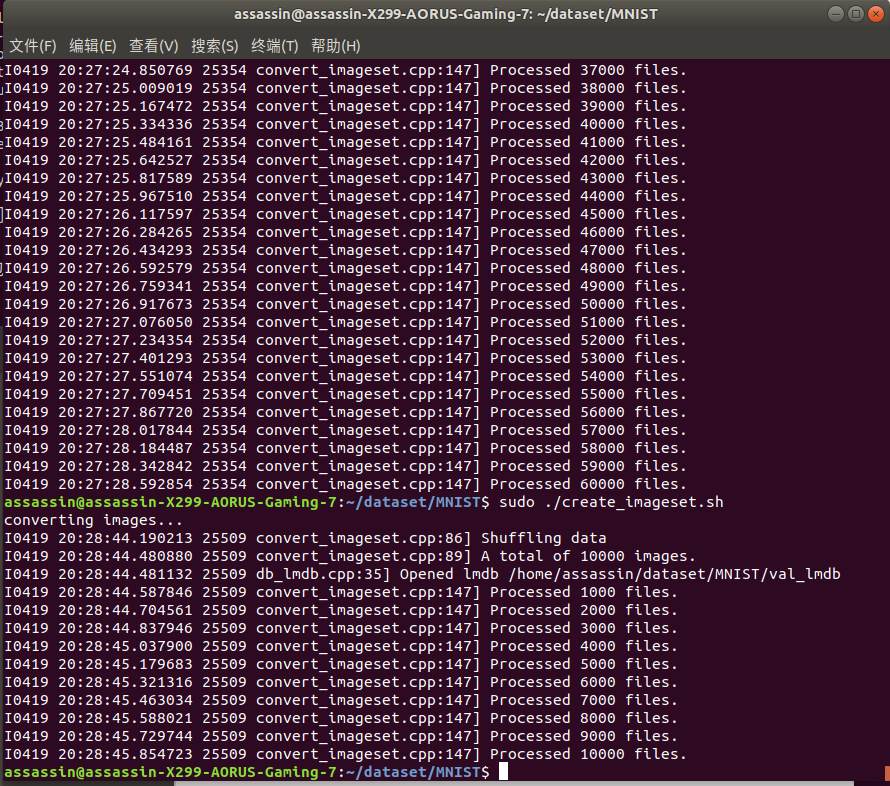
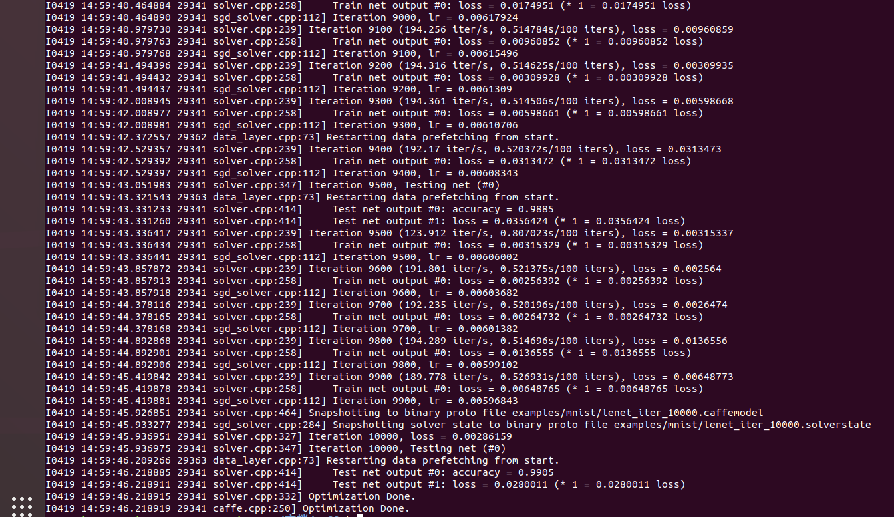

# C++实现lenet-5

以下是未完成内容，主要介绍opencv和mat类的一些用法以及反向传播(前向计算不再赘述)。

全部代码在Github上，可能运行不了，应该说肯定运行不了。

https://github.com/WBAsn/lenet-5-c.git

先说一下感想，以防下面的notes和code太长。。。

为什么用c++呢？我以为用网络类会比写计算的过程要简洁和方便。(不过事实证明好像并非如此)，c++还有许多库可以使用(然而并没有用，并行计算的库都不会用)。写lenet的前向计算比反向迭代要简单一点，主要是在matlab上对forward已经有了较好的理解。

opencv有些操作还是有点困难，在网上也找不到资料，比如矩阵中取消矩阵，取出矩阵中最大元素和位置(位置在反向传播中有用到)。

一开始想用caffe来写的，不过还是不会用，只是照着教程在linux下训练了一遍。







## opencv数据类型

`CV_<bit_depth>(S|U|F)C<number_of_channels>`

```
1--bit_depth---比特数---代表8bite,16bites,32bites,64bites---举个例子吧--比如说,如
        如果你现在创建了一个存储--灰度图片的Mat对象,这个图像的大小为宽100,高100,那么,现在这张
        灰度图片中有10000个像素点，它每一个像素点在内存空间所占的空间大小是8bite,8位--所以它对
        应的就是CV_8
     2--S|U|F--S--代表---signed int---有符号整形
               U--代表--unsigned int--无符号整形
               F--代表--float---------单精度浮点型
     3--C<number_of_channels>----代表---一张图片的通道数,比如:
         1--灰度图片--grayImg---是--单通道图像
         2--RGB彩色图像---------是--3通道图像
         3--带Alph通道的RGB图像--是--4通道图像
```

## Opencv

### Mat类

#### 简介

> Mat本质上是由两个数据部分组成的类： （包含信息有矩阵的大小，用于存储的方法，矩阵存储的地址等） 的矩阵头和一个指针，指向包含了像素值的矩阵（可根据选择用于存储的方法采用任何维度存储数据）。矩阵头部的大小是恒定的。然而，矩阵本身的大小因图像的不同而不同，通常是较大的数量级。

OpenCV 使用引用计数系统。其思想是Mat的每个对象具有其自己的头，但可能他们通过让他们矩阵指针指向同一地址的两个实例之间共享该矩阵。此外，拷贝运算符将只能复制矩阵头部，也还将复制指针到大型矩阵，但不是矩阵本身。

#### 存储方法

这是关于你是如何存储的像素值。您可以选择的颜色空间和使用的数据类型。色彩空间是指我们如何结合为了代码指定的颜色的颜色分量。

- RGB 是最常见的是我们的眼睛使用类似的事情，我们显示系统还撰写使用这些颜色。
- YCrCb 使用流行的 JPEG 图像格式。
- CIE L *b*a 是均匀颜色空间，它是非常方便的如果您需要测量给定的颜色，以另一种颜色的距离。
- 灰度

#### 显示创建Mat对象

##### Mat()构造函数

```cpp
Mat M(2,2, CV_8UC3, Scalar(0,0,255));
```
对于二维的和多通道的图像，我们首先定义它们的大小：按行和列计数。然后我们需要指定的数据类型，用于存储元素和每个矩阵点通道的数量。为此，我们根据以下的约定可以作出多个定义：

`CV_ [每一项的位数] [有符号或无符号] [类型前缀] C [通道数]`

Scalar 是四个元素短向量。指定此和可以初始化所有矩阵点与自定义的值。

##### 使用 C\C++ 数组和通过构造函数来初始化

```cpp
int sz[3] = {2,2,2};
Mat L(3,sz,CV_8UC(1),Scalar::all(0));
```

##### 为一个已经存在的IplImage创建一个头：

```cpp
IplImage* img = cvLoadImage("greatwave.png", 1);
Mat mtx(img); // 转换 IplImage*-> Mat
```

##### Create()函数

```cpp
M.create(4,4, CV_8UC(2));
cout << "M = "<< endl << " " << M << endl << endl;
```

##### MATLAB风格的初始化函数：zeros()， ones()，eyes().指定使用的尺寸和数据类型

```cpp
Mat E = Mat::eye(4, 4, CV_64F);
cout << "E = " << endl << " " << E << endl << endl;
Mat O = Mat::ones(2, 2, CV_32F);
cout << "O = " << endl << " " << O << endl << endl;
Mat Z = Mat::zeros(3,3, CV_8UC1);
cout << "Z = " << endl << " " << Z << endl << endl;
```

##### 对于小的矩阵来说你可以使用逗号隔开的初始化函数：

```cpp
Mat C = (Mat_<double>(3,3) << 0, -1, 0, -1, 5, -1, 0, -1, 0);
cout << "C = " << endl << " " << C << endl << endl;
```

##### 为一个已有的Mat对象创建一个新的头然后clone()或者copyTo()这个头

```cpp
Mat RowClone = C.row(1).clone();
cout << "RowClone = " << endl << " " << RowClone << endl << endl;
```

#### 成员函数

##### Mat::operator =：提供矩阵赋值操作。

> C++: Mat& Mat::operator=(const Mat& m)
> C++: Mat& Mat::operator=(const MatExpr_Base& expr)
> C++: Mat& Mat::operator=(const Scalar& s)

> 参数：
> **m** – 被赋值的右侧的矩阵。 矩阵的赋值是一个复杂度为O(1) 的操作。 这就意味着没有数据段复制并且有数量的递增两矩阵将使用同一引用计数器。在给矩阵赋新数据之前先由Mat::release()释放引用。
> **expr** –被赋值的矩阵表达式对象。 作为第一种赋值方式的逆操作第二种形式可以被重新用到具有适当大小和尺寸的已分配空间的矩阵上以适应表达式的结果。矩阵表达式扩展得到的实函数将自动处理这个分配过程。例如：
> C=A+B 扩展成add(A, B, C) , andadd() 要当心C重新分配数据的操作。.
> **s** – 标量赋值给每一个矩阵元，矩阵的大小和类型将不会改变。有现成的赋值运算符。由于他们各不相同请阅读运算符参数说明。

#### 元素的获取与赋值

##### Mat::at()

用于获取图像矩阵某点的值或改变某点的值。

---

cv::Mat中，

cols代表图像的宽度（图像的列数），

rows代表图像的高度（图像的行数），

step代表以字节为单位的图像的有效宽度，

elemSize返回像素的大小，

channels（）方法返回图像的通道数，

total函数返回图像的像素数。

像素的大小 = 颜色大小（字节）*通道数

---

##### ptr<>()

cv::Mat中提供ptr函数访问任意一行像素的首地址，特别方便图像的一行一行的横向访问，如果需要一列一列的纵向访问图像，就稍微麻烦一点。但是ptr访问效率比较高，程序也比较安全，有越界判断。

```cpp
int nl = image.rows; //行数  
int nc = image.cols * image.channels();
for (int j = 0; j<nl; j++)
{
	uchar* data = image.ptr<uchar>(j);
	for (int i = 0; i<nc; i++)
	{
		data[i] = data[i] / div*div + div / 2;
	}
}
```

##### 迭代器

cv::Mat同样有标准模板库（STL），可以使用迭代器访问数据。

用迭代器来遍历图像像素，可简化过程降低出错的机会，比较安全，不过效率较低；如果想避免修改输入图像实例cv::Mat，可采用const_iterator。iterator有两种调用方法，cv::MatIterator_<cv::Vec3b>it;cv::Mat_<cv::Vec3b>::iterator it;中间cv::Vec3b是因为图像是彩色图像，3通道，cv::Vec3b可以代表一个像素。


使用at函数时，**应该知道矩阵元素的类型和通道数，根据矩阵元素类型和通道数来确定at函数传递的类型,使用的是Vec3b这个元素类型，他是一个包含3个unsigned char类型向量。**之所以采用这个类型来接受at的返回值，是因为，我们的矩阵im是3通道，类型为unsigned char类型

#### 矩阵运算

##### dot——A.dot(B)

1. 对两个向量执行点乘运算，就是对这两个向量对应位一一相乘之后求和的操作，点**乘的结果是一个标量**。 
2. dot方法声明中显示返回值是double，所以**A.dot(B)结果是一个double类型数据，不是Mat矩阵**，不能把A.dot(B)结果赋值给Mat矩阵！

##### mul——A.mul(B)

mul会计算两个Mat矩阵对应位的乘积，所以要求参与运算的矩阵A的行列和B的行列数一致。计算结果是跟A或B行列数一致的一个Mat矩阵。

1. mul操作不对参与运算的两个矩阵A、B有数据类型上的要求，但要求A，B类型一致，不然报错；
2. Mat AB=A.mul(B)，**若声明AB时没有定义AB的数据类型，则默认AB的数据类型跟A和B保存一致**；
3. 若AB精度不够，可能产生溢出，溢出的值被置为当前精度下的最大值；

##### line

绘制直线

```cpp
#include<opencv2/opencv.hpp>
cv::line(src,Point(1,1),Point(250,250),Scalar(0,0,255),5,CV_AA);
```

## 训练结束后需要保存的内容

1. layer_neuron_num，各层神经元数目，这是生成神经网络需要的唯一参数。
2. weights，神经网络初始化之后需要用训练好的权值矩阵去初始化权值。
3. activation_function，使用神经网络的过程其实就是前向计算的过程，显然需要知道激活函数是什么。lenet中默认ReLU。
4. learning_rate，如果要在现有模型的基础上继续训练以得到更好的模型，更新权值的时候需要用到这个函数。

## DNN的反向传播算法

在DNN中，是首先计算出输出层的$δ^L$:
$$
\delta^{L}=\frac{\partial J(W, b)}{\partial z^{L}}=\frac{\partial J(W, b)}{\partial a^{L}} \odot \sigma^{\prime}\left(z^{L}\right)
$$
利用数学归纳法，用$δ^{l+1}$的值一步步的向前求出第l层的$δ^l$，表达式为：
$$
\delta^{l}=\delta^{l+1} \frac{\partial z^{l+1}}{\partial z^{l}}=\left(W^{l+1}\right)^{T} \delta^{l+1} \odot \sigma^{\prime}\left(z^{l}\right)
$$
有了$δ^l$的表达式，从而求出W,b的梯度表达式：
$$
\begin{array}{c}{\frac{\partial J(W, b)}{\partial W^{l}}=\frac{\partial J(W, b, x, y)}{\partial z^{l}} \frac{\partial z^{l}}{\partial W^{l}}=\delta^{l}\left(a^{l-1}\right)^{T}} \\ {\frac{\partial J(W, b, x, y)}{\partial b^{L}}=\frac{\partial J(W, b)}{\partial z^{l}} \frac{\partial z^{l}}{\partial b^{l}}=\delta^{l}}\end{array}
$$

## CNN的反向传播算法

### DNN->CNN

问题：

1. 池化层没有激活函数，这个问题倒比较好解决，可以令池化层的激活函数为$σ(z)=z$，即激活后就是自己本身。这样池化层激活函数的导数为1.
2. 池化层在前向传播的时候，对输入进行了压缩，那么现在需要向前反向推导$δ^{l−1}$，这个推导方法和DNN完全不同。
3. 卷积层是通过张量卷积，或者说若干个矩阵卷积求和而得的当前层的输出，这和DNN很不相同，DNN的全连接层是直接进行矩阵乘法得到当前层的输出。这样在卷积层反向传播的时候，上一层的$δ^{l−1}$递推计算方法肯定有所不同。
4. 对于卷积层，由于$W$使用的运算是卷积，那么从$δ^l$推导出该层的所有卷积核的$W,b$的方式也不同。

由于卷积层可以有多个卷积核，各个卷积核的处理方法是完全相同且独立的，为了简化算法公式的复杂度，下面提到卷积核都是卷积层中若干卷积核中的一个。

### 1. 已知池化层的$δ^l$，推导上一隐藏层的$δ^{l−1}$

在前向传播算法时，池化层一般会用`MAX`或者`Average`对输入进行池化，池化的区域大小已知。现在反过来，要从缩小后的误差$δ^l$，还原前一次较大区域对应的误差。

在反向传播时，首先会把δl的所有子矩阵矩阵大小还原成池化之前的大小，然后如果是MAX，则把$δ^l$的所有子矩阵的各个池化局域的值放在之前做前向传播算法得到最大值的位置。如果是Average，则把$δ^l$的所有子矩阵的各个池化局域的值取平均后放在还原后的子矩阵位置。这个过程一般叫做**upsample**。

---

#### Example

假设的池化区域大小是2x2。$δ^l$的第k个子矩阵为:
$$
\delta_{k}^{l}=\left( \begin{array}{ll}{2} & {8} \\ {4} & {6}\end{array}\right)
$$
由于池化区域为2x2，先将$\delta_{k}^{l}$做还原，即变成：
$$
\left( \begin{array}{ll}{0} & {0}&{0}&{0}\\{0}&{2} & {8} & {0}\\{0} & {4} & {6}&{0}\\{0} & {0}&{0}&{0}\end{array}\right)
$$
如果是MAX，假设之前在前向传播时记录的最大值位置分别是左上，右下，右上，左下，则转换后的矩阵为：
$$
\left( \begin{array}{llll}{2} & {0} & {0} & {0} \\ {0} & {0} & {0} & {8} \\ {0} & {4} & {0} & {0} \\ {0} & {0} & {6} & {0}\end{array}\right)
$$
如果是Average，则进行平均：转换后的矩阵为：
$$
\left( \begin{array}{cccc}{0.5} & {0.5} & {2} & {2} \\ {0.5} & {0.5} & {2} & {2} \\ {1} & {1} & {1.5} & {1.5} \\ {1} & {1} & {1.5} & {1.5}\end{array}\right)
$$
即得到上一层$\frac{\partial J(W, b)}{\partial a_{k}^{l-1}}$的值，要得到$\delta_{k}^{l-1}$:
$$
\delta_{k}^{l-1}=\frac{\partial J(W, b)}{\partial a_{k}^{l-1}} \frac{\partial a_{k}^{l-1}}{\partial z_{k}^{l-1}}=u p s a m p l e\left(\delta_{k}^{l}\right) \odot \sigma^{\prime}\left(z_{k}^{l-1}\right)
$$
upsample函数完成了池化误差矩阵放大与误差重新分配的逻辑。

---

对于张量$δ^{l−1}$，有：
$$
\delta^{l-1}=u p s a m p l e\left(\delta^{l}\right) \odot \sigma^{\prime}\left(z^{l-1}\right)
$$

### 2. 已知卷积层的$δ^l$，推导上一隐藏层的$δ^{l−1}$

卷积层的前向传播公式：
$$
a^{l}=\sigma\left(z^{l}\right)=\sigma\left(a^{l-1} * W^{l}+b^{l}\right)
$$
在DNN中，$δ^{l−1}$和$δ^l$的递推关系为：
$$
\delta^{l}=\frac{\partial J(W, b)}{\partial z^{l}}=\frac{\partial J(W, b)}{\partial z^{l+1}} \frac{\partial z^{l+1}}{\partial z^{l}}=\delta^{l+1} \frac{\partial z^{l+1}}{\partial z^{l}}
$$
因此要推导出$δ^{l−1}$和$δ^l$的递推关系，必须计算$\frac{∂z^l}{∂z^{l−1}}$的梯度表达式。

注意到$z^l$和$z^{l−1}$的关系为：
$$
z^{l}=a^{l-1} * W^{l}+b^{l}=\sigma\left(z^{l-1}\right) * W^{l}+b^{l}
$$
因此有：
$$
\delta^{l-1}=\delta^{l} \frac{\partial z^{l}}{\partial z^{l-1}}=\delta^{l} * \operatorname{rot} 180\left(W^{l}\right) \odot \sigma^{\prime}\left(z^{l-1}\right)
$$
对于含有卷积的式子求导时，卷积核被旋转了180度。

---

#### Example

假设$l−1$层的输出$a^{l−1}$是一个3x3矩阵，第l层的卷积核$W^l$是一个2x2矩阵，采用1像素的步幅，则输出$z^l$是一个2x2的矩阵。简化$b^l$都是0,则有
$$
a^{l−1}∗W^l=z^l
$$
列出$a,W,z$的矩阵表达式如下：
$$
\left( \begin{array}{lll}{a_{11}} & {a_{12}} & {a_{13}} \\ {a_{21}} & {a_{22}} & {a_{23}} \\ {a_{31}} & {a_{32}} & {a_{33}}\end{array}\right) * \left( \begin{array}{ll}{w_{11}} & {w_{12}} \\ {w_{21}} & {w_{22}}\end{array}\right)=\left( \begin{array}{cc}{z_{11}} & {z_{12}} \\ {z_{21}} & {z_{22}}\end{array}\right)
$$
得到：
$$
\begin{array}{l}{z_{11}=a_{11} w_{11}+a_{12} w_{12}+a_{21} w_{21}+a_{22} w_{22}} \\ {z_{12}=a_{12} w_{11}+a_{13} w_{12}+a_{22} w_{21}+a_{23} w_{22}} \\ {z_{21}=a_{21} w_{11}+a_{22} w_{12}+a_{31} w_{21}+a_{32} w_{22}} \\ {z_{22}=a_{22} w_{11}+a_{23} w_{12}+a_{32} w_{21}+a_{33} w_{22}}\end{array}
$$

模拟反向求导：
$$
\nabla a^{l-1}=\frac{\partial J(W, b)}{\partial a^{l-1}}=\frac{\partial J(W, b)}{\partial z^{l}} \frac{\partial z^{l}}{\partial a^{l-1}}=\delta^{l} \frac{\partial z^{l}}{\partial a^{l-1}}
$$
对于$a^{l-1}$的梯度误差$\nabla a^{l-1}$，等于第l层的梯度误差乘以$\frac{\partial z^{l}}{\partial a^{l-1}}$，而$\frac{\partial z^{l}}{\partial a^{l-1}}$对应上面的例子中相关联的$w$的值。假设$z$矩阵对应的反向传播误差是$δ_{11},δ_{12},δ_{21},δ_{22}$组成的2x2矩阵，则利用上面梯度的式子和4个等式，可以分别写出$∇a^{l−1}$的9个标量的梯度。

用矩阵卷积的形式：
$$
\left( \begin{array}{cccc}{0} & {0} & {0} & {0} \\ {0} & {\delta_{11}} & {\delta_{12}} & {0} \\ {0} & {\delta_{21}} & {\delta_{22}} & {0} \\ {0} & {0} & {0} & {0}\end{array}\right) * \left( \begin{array}{cc}{w_{22}} & {w_{21}} \\ {w_{12}} & {w_{11}}\end{array}\right)=\left( \begin{array}{ccc}{\nabla a_{11}} & {\nabla a_{12}} & {\nabla a_{13}} \\ {\nabla a_{21}} & {\nabla a_{22}} & {\nabla a_{23}} \\ {\nabla a_{31}} & {\nabla a_{32}} & {\nabla a_{33}}\end{array}\right)
$$
为了符合梯度计算，我们在误差矩阵周围填充了一圈0，此时我们将卷积核翻转后和反向传播的梯度误差进行卷积，就得到了前一次的梯度误差。这个例子直观的介绍了为什么对含有卷积的式子反向传播时，卷积核要翻转180度的原因。

### 3. 已知卷积层的$δ^l$，推导该层的$W,b$的梯度

对于全连接层，可以按DNN的反向传播算法求该层$W,b$的梯度，而池化层并没有$W,b$,也不用求$W,b$的梯度。只有卷积层的$W,b$需要求出。

由卷积层$z,W,b$的关系:
$$
z^{l}=a^{l-1} * W^{l}+b
$$
可得：
$$
\frac{\partial J(W, b)}{\partial W^{l}}=\frac{\partial J(W, b)}{\partial z^{l}} \frac{\partial z^{l}}{\partial W^{l}}=a^{l-1} * \delta^{l}
$$

注意到此时卷积核并没有反转，主要是此时是层内的求导，而不是反向传播到上一层的求导。

对于第l层，某个卷积核矩阵W的导数可以表示如下：
$$
\frac{\partial J(W, b)}{\partial W_{p q}^{l}}=\sum_{i} \sum_{j}\left(\delta_{i j}^{l} a_{i+p-1, j+q-1}^{l-1}\right)
$$

输入a是4x4的矩阵，卷积核$W$是3x3的矩阵，输出$z$是2x2的矩阵,那么反向传播的z的梯度误差$δ$也是2x2的矩阵。

$$
\frac{\partial J(W, b)}{\partial W^{l}}=\left( \begin{array}{llll}{a_{11}} & {a_{12}} & {a_{13}} & {a_{14}} \\ {a_{21}} & {a_{22}} & {a_{23}} & {a_{24}} \\ {a_{31}} & {a_{32}} & {a_{33}} & {a_{34}} \\ {a_{41}} & {a_{42}} & {a_{43}} & {a_{44}}\end{array}\right) * \left( \begin{array}{cc}{\delta_{11}} & {\delta_{12}} \\ {\delta_{21}} & {\delta_{22}}\end{array}\right)
$$

而对于b,则稍微有些特殊，因为$δ^l$是高维张量，而b只是一个向量，不能像DNN那样直接和$δ^l$相等。通常的做法是将$δ^l$的各个子矩阵的项分别求和，得到一个误差向量，即为b的梯度：
$$
\frac{\partial J(W, b)}{\partial b^{l}}=\sum_{u, v}\left(\delta^{l}\right)_{u, v}
$$

## 总结

输入：m个图片样本，CNN模型的层数L和所有隐藏层的类型，对于卷积层，要定义卷积核的大小K，卷积核子矩阵的维度F，填充大小P，步幅S。对于池化层，要定义池化区域大小k和池化标准（MAX或Average），对于全连接层，要定义全连接层的激活函数（输出层除外）和各层的神经元个数。梯度迭代参数迭代步长$α$,最大迭代次数MAX与停止迭代阈值$ϵ$

输出：CNN模型各隐藏层与输出层的$W,b$

1. 初始化各隐藏层与输出层的各$W,b$的值为一个随机值。
2. for iter to 1 to MAX：
   1. for i =1 to m：
   2.  将CNN输入$a^1$设置为$x_i$对应的张量
   3.   for l=2 to L-1，根据下面3种情况进行前向传播算法计算：
         1. 如果当前是全连接层：则有$a^{i, l}=\sigma\left(z^{i, l}\right)=\sigma\left(W^{l} a^{i, l-1}+b^{l}\right)$
        2. 如果当前是卷积层：则有$a^{i, l}=\sigma\left(z^{i, l}\right)=\sigma\left(W^{l} * a^{i, l-1}+b^{l}\right)$
        3. 如果当前是池化层：则有$a^{i, l}=pool(a^{i, l-1})$, 这里的pool指按照池化区域大小k和池化标准将输入张量缩小的过程
    4.  对于输出层第L层: $a^{i, L}=\operatorname{softmax}\left(z^{i, L}\right)=\operatorname{softmax}\left(W^{L} a^{i, L-1}+b^{L}\right)$
    5.  通过损失函数计算输出层的$δ^{i,L}$
    6.  for l= L-1 to 2, 根据下面3种情况进行进行反向传播算法计算:
        1. 如果当前是全连接层：$\delta^{i, l}=\left(W^{l+1}\right)^{T} \delta^{i, l+1} \odot \sigma^{\prime}\left(z^{i, l}\right)$
        1. 如果当前是卷积层：$\delta^{i, l}=\delta^{i, l+1} * \operatorname{rot} 180\left(W^{l+1}\right) \odot \sigma^{\prime}\left(z^{i, l}\right)$
        2. 如果当前是池化层：$\delta^{i, l}=u p s a m p l e\left(\delta^{i, l+1}\right) \odot \sigma^{\prime}\left(z^{i, l}\right)$
    8. for l = 2 to L，根据下面2种情况更新第l层的$W^l,b^l$:
       1.  如果当前是全连接层：$W^{l}=W^{l}-\alpha \sum_{i=1}^{m} \delta^{i, l}\left(a^{i, l-1}\right)^{T}, \quad b^{l}=b^{l}-\alpha \sum_{i=1}^{m} \delta^{i, l}$
       2.   如果当前是卷积层，对于每一个卷积核有：$W^{l}=W^{l}-\alpha \sum_{i=1}^{m} \delta^{i, l} * a^{i, l-1}$,$b^{l}=b^{l}-\alpha \sum_{i=1}^{m} \sum_{u, v}\left(\delta^{i, l}\right)_{u, v}$
    9.  如果所有$W，b$的变化值都小于停止迭代阈值$ϵ$，则跳出迭代循环到步骤3。
3. 输出各隐藏层与输出层的线性关系系数矩阵$W$和偏倚向量$b$。

## ReLU求导

## SoftMax

softmax用于多分类过程中，它将多个神经元的输出，映射到（0,1）区间内，可以看成概率来理解，从而来进行多分类

$$S_i=\frac{e^i}{\sum_je^j}$$


### softmax求导

当我们对分类的Loss进行改进的时候，我们要通过梯度下降，每次优化一个step大小的梯度，这个时候就要**求Loss对每个权重矩阵的偏导，然后应用链式法则。**

#### 交叉熵(cross entropy)

$$loss=-\sum _i y_ilna_i$$

y为真实值，a为输出值。

$$\Rightarrow loss=y_jlna_j$$

$$a_i-y_i$$

## 全连接层权重更新

$$[weights\; diff\;]_{i\times  j}=[data_{in}]_{i\times batch} *[top\;diff]_{batch*\times j}$$

$$
\frac{\partial a_{i}}{\partial b_{i}}=1
$$


